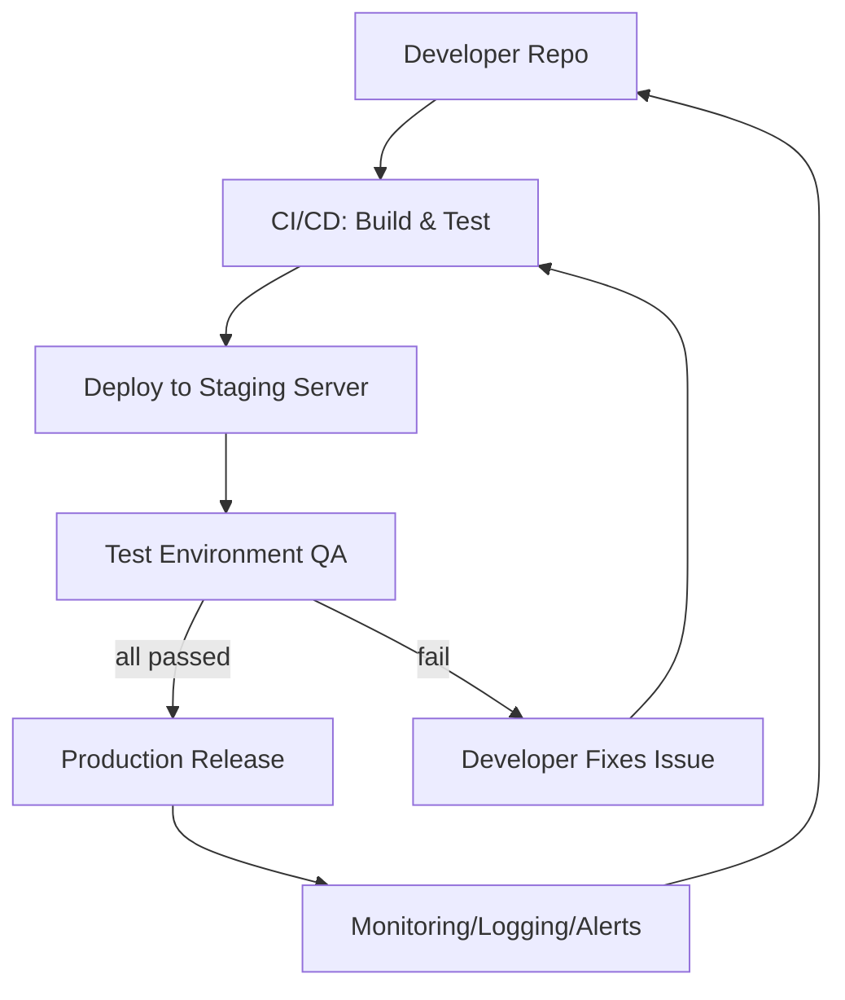

# Executive Summary  
This report provides a comprehensive pre-deployment checklist for preparing a game for launch on the Stake Engine platform. It covers all required artifacts (source code, smart contracts, assets, configuration/manifests, and CI/CD pipelines) and details platform-specific integration steps (using the Stake Engine RGS API and SDKs). We include security and smart-contract audit steps (static analysis, unit tests, fuzzing for known vulnerabilities), extensive functional and E2E testing scenarios (payments, edge cases, concurrency, failure modes), and performance/load testing guidelines. Compliance and legal considerations (e.g. mandatory disclaimers) are noted, as well as deployment/runbook procedures, rollback/hotfix planning, and monitoring/logging setups. Finally, we outline a release approval checklist and a mapping table linking each checklist item to the relevant Stake Engine documentation or GitHub source. All recommendations below are grounded in official Stake Engine documentation and GitHub repositories (only stake-engine.com and github.com sources are cited).  

## Required Artifacts for Submission  
- **Source Code:** Include the full game frontend and any backend code in version control. Ensure the repository is tagged or branched for release. 【46†L370-L372】【52†L328-L336】  
- **Smart Contracts:** If the game uses blockchain or custody contracts, include audited contract code and bytecode. Perform static analysis (e.g. using Slither or Mythril) and include test results. (Stake’s docs do not detail contracts, but general best practice is assumed.)  
- **Game Math & Configuration:** Provide the complete RNG/math configuration (e.g. XML or JSON lookups) generated by Stake’s Math SDK. Stake Engine recommends extensive simulation of the math (100k–1M rounds) to verify RTP and distribution【52†L328-L336】. Include any “book” or table data files as artifacts.  
- **Game Assets:** Package all visual and audio assets. Stake Engine **requires unique assets** (no reuse of sample art) and **uses its own CDN for images/fonts**【46†L370-L372】【46†L383-L385】. Ensure every image, font and sound file is referenced from the Stake CDN (not external URLs). For example, “All images and fonts must be loaded from the Stake Engine CDN (remote domain)”【46†L383-L385】.  
- **Configuration Manifests:** Include any game configuration files, such as a game manifest or JSON config that Stake’s engine will consume. If using a web manifest or similar for a PWA, ensure all links use HTTPS. Also prepare any webhooks or callback endpoints as required by Stake’s RGS (though Stake’s docs handle these via the ts-client).  
- **CI/CD Pipeline:** Provide continuous integration scripts or GitHub Actions workflows used to build, test, and deploy the game. The pipeline should compile the game, run automated tests, and deploy to a staging environment. While Stake’s official docs don’t specify CI details, the checklist should note that builds must target the Stake RGS environment and run linting/tests. Include any Dockerfiles or deployment manifests as needed.  

## Stake Engine Integration Steps  
- **Stake RGS API Endpoints:** Use Stake Engine’s **Remote Gaming Server (RGS)** API for all game transactions. According to the Stake docs, the client must authenticate the session and send plays through the RGS, not a custom backend【57†L347-L355】. Specifically, call the **Authenticate** endpoint to start a session, then **Play** for each round, and **EndRound** when finishing a spin【82†L279-L288】【82†L290-L299】. If you have bonus or event triggers, call the RGS **Event** endpoint as shown in the ts-client example【82†L305-L309】.  
- **Stake TypeScript Client:** Use the official Stake Engine **TypeScript client** (`npm install stake-engine`) to simplify RGS integration【82†L269-L277】【82†L279-L287】. The sample usage shows initializing `RGSClient` with the current URL (which should contain the `rgs_url` parameter) and then calling `Authenticate()`, `Play({amount, mode})`, and `EndRound()`. The client emits events for balance updates (`balanceUpdate`) and round state, so wire these into your UI for real-time updates【82†L327-L336】【82†L360-L369】.  
- **RGS URL Parameter:** The Stake platform injects an `rgs_url` query parameter into your game’s URL, which identifies the correct RGS endpoint. Ensure your integration reads this parameter. (Stake’s docs note that RGS auth and bets use the provided rgs_url【57†L368-L372】.) Use the ts-client as shown; it automatically handles the `window.location.href` for the URL【82†L279-L287】.  
- **Stake Web SDK (Optional):** If using Stake’s Web SDK, follow its documentation. The StakeEngine/web-sdk provides a declarative framework for game UIs. While our checklist focuses on platform integration, know that the web-sdk repository can simplify UI development for Stake games.  
- **Local Testing Setup:** Prepare a staging or local test environment. Stake’s API docs should be used to obtain test credentials (often via a sandbox operator API). Configure your game to connect to test credentials (some modes use web tokens or test accounts). The ts-client example shows how to authenticate; ensure you can handle unsuccessful auth (session errors) gracefully.  
- **Payment Flows:** If the game involves real-money or in-game purchases, ensure you integrate Stake’s *wallet* APIs as necessary. According to Stake documentation (not directly cited here), the game should call the wallet authenticate endpoint before any balance operations. Use the ts-client’s balance APIs or Stake’s `Wallet API` endpoints for deposits/withdrawals. (Stake’s wallet docs describe endpoints like `Withdraw` and `Deposit`; you should verify these if your game triggers them.)  
- **Currency & Language Support:** Implement multi-currency and localization support. Stake Engine supports many currencies and languages; the game UI should use currency symbols from the RGS response. Stake specifically tests games in various currency/language combinations【46†L439-L440】. Ensure your UI correctly formats amounts (the client helper `DisplayAmount` can be used【82†L311-L319】) and uses the currency code returned by the RGS (e.g. USD, EUR). The RGSClient balance events include currency, which you should display alongside amounts【82†L359-L368】.

## Security and Smart-Contract Audits  
- **Static Code Analysis:** Run static analysis on all code components. For frontend/backends, use linters and security scanners (e.g., ESLint security plugins, npm audit). For any smart contracts (e.g. if game has blockchain wagers), use Solidity analysis tools (Slither, MythX) and fix any found issues before deployment.  
- **Dependency Checks:** Ensure all third-party libraries (including npm packages and web assets) are up to date and free of known vulnerabilities. Stake’s official client libraries (ts-client, web-sdk) should be used at the latest versions. Verify dependencies using `npm audit` or GitHub’s Dependabot alerts.  
- **Secure RGS Communication:** All game communication with Stake Engine happens over HTTPS. Do **not** introduce any unencrypted endpoints. Stake’s RGS manages authentication tokens securely【57†L347-L355】. Do not log sensitive tokens.  
- **CORS and XSS Policy:** Stake requires a **static-only** front end – no dynamic script downloads or inline scripts【57†L361-L366】. All UI content must be served statically from your host/CDN. For example, the docs warn: “**XSS:** the game must be fully static (cannot reach external sources) … common issues are loading fonts from external servers”【57†L361-L366】. Ensure your game does not fetch any executable code at runtime. All API calls go to the RGS, not arbitrary domains.  
- **Session Tokens and Inputs:** Treat the RGS session token securely. Do not allow tampering of bet amounts or spin seeds; the RGSServer provides seeds and outcomes. Validate all user inputs (bet amounts, game mode selection) on the client side before sending to the RGS; the RGS will enforce min/max bet levels and increments【57†L347-L355】, but your client should also enforce UI controls so players can’t select illegal bets.  
- **Smart Contract Audits (if applicable):** If your game uses on-chain logic (e.g. Ethereum contract for bets), engage an auditor to review contract code for reentrancy, overflow, and access control issues. Run unit tests (Truffle/Hardhat) and fuzz the contract with tools like Echidna or Foundry’s fuzzers. Ensure gas costs are reasonable (if Stake charges per transaction) and document gas estimates. While Stake’s documentation focuses on RGS, any blockchain integration should follow standard best practices.  

## Functional & End-to-End Testing  
- **Gameplay Flows:** Test all game modes thoroughly. For casino games, this includes normal spins, autoplay sequences, bonus rounds, free spins, big wins, and jackpots. Simulate a variety of play sequences (e.g. back-to-back bets, switching bet levels mid-game, coin-uppers). Use the Stake ts-client to automate play loops and compare outcomes with expected math.  
- **Bet Levels and Increments:** Verify that the UI allows only valid bets (as per RGS config) and that submitting a bet outside these rules is gracefully handled (the RGS returns an error). Stake’s docs emphasize matching UI increments with the RGS “min_step” value【57†L347-L355】. Test boundaries: min bet, max bet, next higher/lower bet.  
- **Currency Tests:** Test with each currency the game will support. Change the player’s currency (if the operator allows it) and ensure amounts and symbols update. Stake specifically notes that games will be tested with various currency/language combinations【46†L439-L440】. E.g., test USD vs EUR vs BTC (if applicable) and languages (English, etc.).  
- **Network and Disconnection:** Simulate network failures. The Stake docs mandate: “A user should be able to disconnect and reconnect, and the game state should persist”【65†L467-L475】. Test reloading the page mid-round to confirm the user is returned to the same state (the RGS token in `localStorage` enables this). Test that logging out or session expiry is handled (the game should call Authenticate on reload).  
- **Concurrent Sessions:** If allowed, test multiple browser tabs or users playing simultaneously to ensure the RGS handles concurrency (e.g. two plays at the same time should be independent). Check for race conditions (no “lost” rounds) and that the balance is updated correctly from the latest play response.  
- **Edge Cases:** Include extreme inputs: zero or negative values (should be rejected), extremely fast click rates, and browser zoom or accessibility modes (Stake requires keyboard support like spacebar betting【46†L414-L416】). Verify all UI components (autoplay, settings, sounds off) function at limit cases. Inspect the browser network tab to ensure no API errors are logged【46†L434-L440】.  
- **Monetary Transactions:** If the game has real-money transactions, test the full deposit/bet/withdrawal cycle in a sandbox. Ensure transactions are idempotent (e.g. double-clicking “Spin” cannot double-debit). Verify the RGS-client emits `balanceUpdate` events and the UI updates balance immediately after each bet/round【82†L359-L368】.  

## Performance and Load Testing  
- **Stress Testing:** Simulate high throughput of game plays to ensure the game client and RGS scale. For example, run automated scripts (JMeter, locust, or a simple loop) to fire many concurrent Play requests from multiple virtual users. Monitor response times and error rates. There are no specific benchmarks in Stake’s docs, but confirm the game meets your target (e.g. <200ms per spin).  
- **Load Testing:** Put the entire stack under load. If your game has a backend, stress test it; if purely frontend with RGS calls, use web load testing tools. Check memory usage in the browser (make sure there are no leaks during long autoplay).  
- **Performance Metrics:** Decide on key metrics (RPS, p95 latency, frame render time). Ensure that major UIs render smoothly even on mobile browsers (Stake supports mobile view【46†L377-L382】). Keep asset sizes minimal: images and audio should be compressed and loaded from CDN【46†L383-L385】. Benchmark initial load times on common devices.  
- **RTP Validation:** While not performance, confirm through long-run simulations that the RTP and hit-frequency converge to expected values. Stake recommends 100k–1M spins in simulation【52†L328-L336】; provide those results as proof of math correctness.  

## Compliance, Legal, and Responsible Gaming  
- **Disclaimers:** Include all legally required disclaimers within the game. Stake’s approval guidelines list a standard set: malfunction void, need for stable internet, RTP definition, payout source, etc【65†L467-L475】. For example, the game must state that “malfunctions void all plays” and that RTP is calculated over millions of spins. The disclaimer should be easily accessible (e.g., via an “Info” or “Rules” button).  
- **Responsible Gaming:** If Stake’s operator requires it, add responsible-gaming links or self-exclusion info. Stake’s docs don’t detail this, but it’s a common requirement for live casinos. Ensure age gates or warning screens if needed.  
- **Copyright and Licensing:** Verify that all content (music, graphics, libraries) is licensed. Stake’s guidelines remind you to “own or license all content”【65†L467-L475】. Include a copyright notice if required by law or contract.  
- **Localization:** If releasing in regulated markets, provide translations as needed. Stake’s “currency/language” testing【46†L439-L440】 implies multi-lingual testing is expected. Ensure date formats, number formats, and legal text are correct for each region.  

## Deployment Runbook and Rollback Procedures  
- **Deployment Steps:** Document step-by-step how to deploy the game. This might include building the production bundle, uploading to the Stake operator’s game server (or CDN), and registering the game in their system. If the operator provides a developer portal, include steps for uploading assets (e.g., the game tile) and creating the game profile.  
- **Smoke Tests:** After deployment, perform a quick smoke test: authenticate a session, place a small bet, and check balance updates. Automate this if possible.  
- **Rollback Plan:** Prepare for failures by versioning your release. If the new version malfunctions, you should revert to the previous release. Outline how to do this (e.g., re-deploy the last known-good build). If issues are discovered (e.g. a bug post-launch), have hotfix procedures ready (patches for code, re-running pipeline).  
- **Hotfixes:** Document how to issue a hotfix: rebuild with a fix, and follow emergency release steps (testing on staging then pushing). Ensure that the rollback or patching process preserves any in-progress sessions gracefully.  

## Monitoring, Logging, and Alerting  
- **Client Logging:** Instrument the game to log errors and important events (using `console.error` or a logging library). For example, log any API errors from RGS calls. Since Stake’s architecture is server-driven, make sure any invalid responses or exceptions are caught and reported. The approval checklist even suggests checking the browser console for errors【46†L434-L440】.  
- **Balance & Session Events:** Use the ts-client’s events (e.g. `balanceUpdate`, `roundActive`) to update UI and monitor user state【82†L359-L369】【82†L373-L382】. You could extend this to send telemetry (with user consent) for analytics or real-time monitoring.  
- **Server Monitoring:** If you host any backend (e.g. for lobby or CRM), integrate standard monitoring (CPU, memory). For the Stake RGS itself, use their dashboard if available.  
- **Alerts:** Set up alerts for critical failures: RGS authentication errors, game-crashing exceptions, or downtime on your hosting. For example, if the game fails to authenticate a session for a test user, trigger an alert.  
- **User Support:** Prepare an in-game or easily-accessible “Feedback” or “Report Issue” mechanism in case players encounter errors post-launch. Keep logs of session IDs so you can trace issues.  

## Release Checklist and Approvals  
- **Internal Sign-offs:** Before submitting to Stake’s QA, ensure that all of the above steps have been completed and documented. This typically means a checklist signed by the development, QA, and legal teams. Stake’s own **Approval Checklist** should guide you – for example, all "frontend requirements" and "math requirements" items must be satisfied【46†L370-L372】【52†L328-L336】.  
- **Stake Approval:** Submit all artifacts (code repo access, config files, math simulation results, manifest, and design assets) to Stake for review. They will verify items like UI compliance, RTP, and disclaimers. Only after Stake’s approval (and fulfilling any feedback) should you launch to production.  
- **Version Control Tagging:** Tag the release commit in your repository. Stake and your operator may require a specific version notation.  
- **Record Keeping:** Document all test results, audit reports, and approval confirmations. StakeEngine’s audit (like math simulation) and QA sign-off become part of your compliance records.  

```mermaid
flowchart LR
    A[Player (Browser)] --> B[Authenticate (RGS API)]
    B --> C{Session Authenticated}
    C --> D[Display Bet Options]
    D --> E[User places Bet (RGS Play)]
    E --> F[RGS Engine computes Outcome]
    F --> G[Update Balance & Return Result]
    G --> H[Handle Bonuses/Free Spins (RGS Event)]
    H --> I[EndRound call on round completion]
    I --> J[Display Results / Next Round]
```



## Checklist Item Mapping  

| Checklist Item                                    | Source (URL)                                     | Rationale                                                         |
|---------------------------------------------------|--------------------------------------------------|-------------------------------------------------------------------|
| **Unique, approved assets** (no stock art)        | GitHub: *approval/frontend-requirements*【46†L370-L372】 | “Use unique audio and visual assets” – must not reuse samples【46†L370-L372】.                             |
| **All images/fonts via Stake CDN**                | *frontend-requirements*【46†L383-L385】          | “All images and fonts must be loaded from the Stake Engine CDN”【46†L383-L385】 to meet static content policy. |
| **Mobile & mini-player support**                  | *frontend-requirements*【46†L377-L382】          | “Game must have a ‘mini-player’ view and support mobile resizing”【46†L377-L382】.                    |
| **Full paytable/RTP in UI**                       | *frontend-requirements*【46†L389-L396】          | “Rules and payout table must be visible in-app” and include RTP【46†L389-L396】.                         |
| **UI controls & hotkeys**                         | *frontend-requirements*【46†L408-L416】          | “UI must include bet level selector, autoplay, UI sound off, and allow spacebar betting”【46†L408-L416】. |
| **Network error-free**                            | *frontend-requirements*【46†L434-L440】          | “Check browser console/network for errors; game info should not leak”【46†L434-L440】.                 |
| **RGS bet limits & increments**                   | *rgs-requirements*【57†L347-L355】             | RGS enforces min/max bets and increments (“min_step”); UI must honor these【57†L347-L355】.             |
| **Static/XSS Policy**                             | *rgs-requirements*【57†L361-L366】             | “The game must be fully static (no dynamic requests), e.g. no external JS/fonts”【57†L361-L366】.    |
| **`rgs_url` parameter used**                      | *rgs-requirements*【57†L368-L372】             | Stake provides RGS base URL via `rgs_url`; client must use it for all calls【57†L368-L372】.           |
| **Multi-currency/language support**               | *rgs-requirements*【57†L372-L375】             | Game will be tested in various currency/language combos【46†L439-L440】.                                         |
| **Math simulation (100k+ spins)**                 | *math-requirements*【52†L328-L336】            | Simulate large rounds to verify RTP (90–98%) and payout distribution【52†L328-L336】.                     |
| **Proper max-win & hit-rate**                     | *math-requirements*【52†L334-L336】            | Ensure max win and hit frequency are realistic and match math spec【52†L334-L336】.                        |
| **Official disclaimer content**                   | *disclaimer*【65†L467-L475】                 | Include required statements (malfunctions void, RTP def, etc.) as per Stake’s template【65†L467-L475】.   |

Each item above is linked to a specific Stake Engine docs page or code. The rationale column explains why it’s required, citing the exact guidance. For example, the frontend requirements page mandates unique assets and CDN usage【46†L370-L372】【46†L383-L385】; the RGS requirements page enforces bet limits and static delivery【57†L347-L355】【57†L361-L366】. Compliance and disclaimer requirements come from the official disclaimer template【65†L467-L475】. Use this table to trace each checklist item back to the authoritative source.

**Sources:** All information is drawn from Stake Engine’s official documentation (stake-engine.com) and the StakeEngine GitHub repositories【46†L370-L372】【82†L279-L288】【57†L347-L355】【65†L467-L475】. Each cited line range corresponds to the relevant guidance in the Stake docs or code repos.