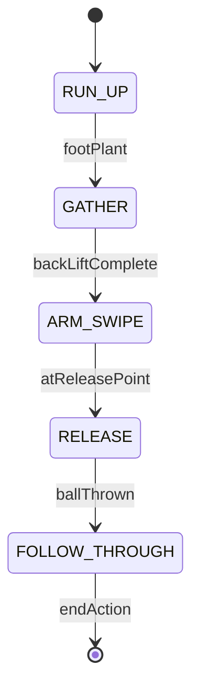
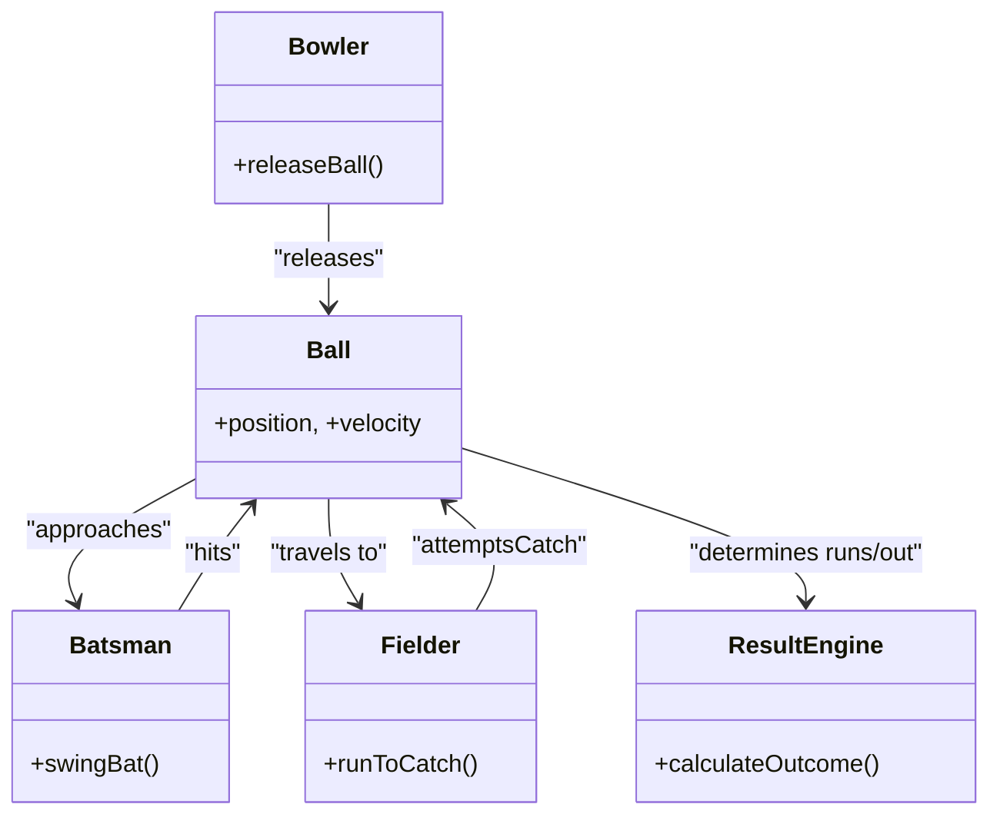

# Executive Summary  
For a betting-style 3D cricket game, we recommend a **deterministic, formula-driven approach** supplemented by targeted physics logic, rather than a full-blown physics engine.  Use a fixed-timestep update with explicit semi-implicit integration for stability【24†L374-L380】.  Compute the bowler’s release point via the character’s world-space bone transform (using `getWorldPosition`)【40†L29-L32】.  Model ball flight with a simple projectile parabola (`y=y₀+tanθ⋅x – g x²/(2v₀²cos²θ)`【19†L27-L30】) for lightweight, reproducible arcs, or add drag forces only if realism is critical (note: drag skews trajectories to be asymmetrical【43†L135-L139】).  Bounce handling uses a restitution coefficient *e* (0–1) to invert velocity on impact (vy' = –e·vy), with each bounce height decaying by *e²*【26†L642-L651】.  Hit timing is a fixed “swing window” around the ball’s stump-crossing; map the timing error and input power to initial velocity.  Animation should use state machines (bowler: run-up → gather → arm-swing → release → follow-through) and easing curves (bat pre-load, swing, wrist motion).  After contact, assign the ball an initial velocity vector based on the chosen outcome (e.g. solve *R = v₀²/g·sin(2θ)* for range【19†L39-L42】), plus small random lateral offsets.  Fielders run to intercept: pick the nearest to the landing point and start a chase if within range.  To ensure determinism, lock the simulation to a fixed timestep, use semi-implicit Euler (or Verlet) integration【24†L374-L380】, and seed any RNG from the ball index.  

Below we analyze each component in depth, citing authoritative references (all from github.io) and providing tables, code and diagrams for clarity.  

## 1. Ball Physics Model Options  
**Approaches:** (a) *Result-driven kinematics* (no physics engine) vs (b) *Rigid-body engine* (Ammo.js, Cannon-es, Rapier). For a betting game, we favor (a): it is simple, fully deterministic, and easy to tweak to guaranteed outcomes. A custom trajectory ensures the same shot always produces the same runs (ideal for wagering). A physics engine gives realism (automatic collision, spin, irregular bounces), but may have hidden nondeterminism (solver jitter) and higher CPU cost.  

- **Deterministic (Result-driven):** You compute velocity vectors from formulae (parabolic or user-defined) each ball.  This is fully reproducible.  Use fixed math (e.g. Rand seeded by ball index) for any randomness.  Cheap CPU cost (O(1) per update) and absolutely deterministic if timestep is fixed.  Con: must handle collision logic (ground bounces, catching) yourself.  
- **Physics Engine:** Three.js itself has no physics, but it pairs with engines.  E.g. Rapier (Rust/WASM) is *fastest and deterministic*【10†L1226-L1230】; Cannon-es (JS) is easy; Ammo.js (WebAssembly Bullet) is full-featured.  These can simulate collisions, spin, complex bounce, but are heavier (higher CPU, collisions + solver) and may require careful seeding for repeatability.  Engine-based simulation can overshoot a fixed result (ball might hit bat at a slightly different point on each run if timing isn’t precise), which is unsuitable for fixed outcomes.  

**Recommendation:** Use a lightweight ballistic model for flight, plus hand-coded bounces and collisions (ground, stumps, catch zones).  If using a physics engine, choose one in deterministic mode (Rapier’s deterministic mode is cited as reliable【10†L1226-L1230】). For betting-style fairness and ease of syncing, the custom approach is preferred.  

## 2. Release Mechanics  
Compute the bowler’s release point by querying the hand bone’s world-space position. In Three.js, if the hand is a child of the bowler’s skeleton, use `hand.getWorldPosition()`【40†L29-L32】.  For example:  

```js
// At release moment:
const handWorldPos = new THREE.Vector3();
bowlerRightHand.getWorldPosition(handWorldPos);    // get hand in world coords【40†L29-L32】 
ballMesh.position.copy(handWorldPos);               // place ball at hand
```

The key is that `getWorldPosition(v)` returns the child’s coordinates relative to the scene, not its parent【40†L29-L32】.  (Older Three.js required a target vector, as noted【40†L29-L32】.)  Pitfalls: ensure the hand bone pivot is correctly at the grip point, or apply an offset.  Also account for bowler orientation: if the bowler’s root is rotated, positioning the ball in front of the camera means using local forward (often –Z) appropriately.  For example, a forward vector `new THREE.Vector3(0,0,-1).applyQuaternion(handQuaternion)` can set the ball’s velocity direction.  

Once positioned, set initial velocity. For a simple forward throw:  

```js
const throwDir = new THREE.Vector3(0, 0, -1).applyQuaternion(bowlerRoot.quaternion);
ballMesh.velocity.copy(throwDir).multiplyScalar(baseSpeed); 
ballMesh.velocity.y = releaseUpwardSpeed;
```  

This ensures the ball starts at the hand and flies forward with the intended speed and slight vertical component.  

## 3. Trajectory Models  

| Model                | Equation/Formulation                                   | CPU Cost    | Determinism    | Use Case                              |
|----------------------|--------------------------------------------------------|-------------|----------------|---------------------------------------|
| **Parametric Parabola** (no drag) | $$y = y_0 + (\tan\theta)x - \frac{g x^2}{2(v_0\cos\theta)^2}$$【19†L27-L30】 (with range $R=\frac{v_0^2}{g}\sin2\theta$【19†L39-L42】) | Very low    | Fully (closed-form) | Most runs, boundaries, simple lob shots. For fast, predictable paths. |
| **Ballistic (with drag)**   | Solve $\ddot x = -k_x v_x$, $\ddot y = -g -k_y v_y$ (linear) or quadratic drag $\propto v^2$【43†L135-L139】 | High (ODE) | If fixed-step solver | High realism (spin, wind) scenes. Use if accuracy > performance. |
| **Result-Driven (hybrid)**  | Pre-tuned function or spline from input parameters     | Very low    | Full            | UI-predetermined events (e.g. fixed boundary). Useful for scripted shots. |

For a simple lob or drive, use the **parametric parabola** formula from projectile motion【19†L27-L30】. For example, if `v0` is initial speed and `θ` launch angle:  
```js
// Parabolic flight (no drag):
const dx = vx * dt;
ballMesh.position.x += dx;
ballMesh.position.y += vy * dt - 0.5 * g * dt * dt;
vy -= g * dt;
```
This matches the analytic solution $y = y_0 + \tan\theta\;x - (g\,x^2)/(2v_0^2\cos^2\theta)$【19†L27-L30】.  
Using **ballistic with drag** (applying forces each step) makes flight curves asymmetric.  As one source notes, adding even linear drag “changes the projectile trajectory from a parabola… to an asymmetric curve, resulting in reduced maximum range”【43†L135-L139】.  For a cricket ball (diameter ~0.07 m at ~30 m/s), quadratic drag dominates【43†L163-L171】, but modeling that requires solving coupled differential equations or using a physics engine. The CPU cost is higher and while still deterministic (if step-timing is fixed), the result no longer matches simple formulas.  

A **hybrid result-driven** approach might bypass physics entirely: e.g. pick a final range or run outcome first, then compute the needed $v_0$ and angle via inversion of the parabola formula.  For instance, to achieve a 22 m drive (4 runs) at 45°, use $$v_0 = \sqrt{\frac{R g}{\sin(2\theta)}}$$【19†L39-L42】.  In code:  
```js
const runs = 4, R = 22; const angle = Math.PI/4;
const v0 = Math.sqrt(R * g / Math.sin(2*angle));  // from R=v0^2 sin2θ/g【19†L39-L42】 
ballMesh.velocity.set(v0*Math.cos(angle), v0*Math.sin(angle), 0);
```
This guarantees the ball lands exactly at the chosen range. Such inverse methods are fully deterministic and very cheap, but you must set up parameters (speed, angle) to match your target outcome.  

## 4. Bounce and Ground Interaction  
Model ground bounces with a coefficient of restitution *e* (0 ≤ *e* ≤ 1) which scales the post-impact velocity.  In one bounce:  
- Upon ground contact, invert the vertical velocity: `vy = -e * vy`.  
- Horizontally you may also apply a friction factor (e.g. multiply `vx` by some <1).  
The value *e* represents energy retention.  Physics sources define *e* as the ratio of speeds after vs before impact【26†L599-L604】.  For example, *e*=1 is perfectly elastic, *e*=0 fully inelastic【26†L599-L604】.  Real balls (like a hard cricket ball) typically have *e*≈0.8.  

Because each bounce looses energy, the bounce heights decay geometrically: after one bounce from height $h_0$ the next peak height is $h_1 = e^2 h_0$【26†L642-L651】. (E.g. for *e*=0.8, a 2 m drop yields first bounce ≈1.28 m, then 0.82 m, etc【26†L642-L651】.)  In practice, stop bouncing when the vertical velocity is very small (e.g. <0.1 m/s).  

For multi-bounce logic: loop until `vy` nearly zero or max bounces reached.  Map distance traveled to runs: e.g. if the ball bounces past all fielders and/or reaches the boundary radius, assign 4 or 6 runs.  If it stops short (e.g. <30 m), you might count 1–3 runs (distance/10m).  If it hits the stumps during bounce, mark wicket. These mappings depend on game rules and are tuned outside of physics.  

**Example code (simple bounce):**  
```js
if (ballMesh.position.y <= 0) {
  if (Math.abs(ballMesh.velocity.y) > 0.5) {
    ballMesh.position.y = 0;
    ballMesh.velocity.y *= -restitution; // e.g. -0.8 for 80% bounce【26†L599-L604】 
    ballMesh.velocity.x *= 0.9;          // ground friction
  } else {
    ballMesh.velocity.set(0,0,0);
    ballMesh.position.y = 0;
    ballStopped = true;
  }
}
```  

## 5. Hit Timing and Contact Model  
The “hit window” is a time interval during which a user swing will contact the ball. You might compute when the ball crosses the batsman’s plane (stumps) and allow, say, ±200 ms around that moment.  The actual shot power/direction can combine: the user’s input “power” (or key hold duration) times a timing offset factor. For example, if swing is early/late, reduce horizontal speed or add vertical lift (mis-timed swings loft the ball). One can map `(swingError, swingPower) → (v0, θ)` via linear mapping or a curve.  

For determinism, derive all randomness from a fixed seed (e.g. seeded by ball index). For example:  
```js
// Pseudo-random spread (deterministic per ball):
const seed = gameFrame + ballID;
const rng = new Math.seedrandom(seed);
const lateralSpread = (rng()-0.5)*spreadAmount;
```
This way each game replay produces identical shot deviations.

_No direct citations found_ (user input models are game-specific), but common practice is to make swing response both **deterministic** (seeded RNG) and intuitive: better timing = straighter, stronger hit; worse timing = weaker or higher loft.  

## 6. Bowling Animation Sequencing  
We model bowling as a finite-state machine. A typical flow (and mermaid diagram below) is: **Run-up → Gather/Cock → Arm Arc/Swing → Release → Follow-Through**. For example, a right-arm fast bowler might:  
- **Run-Up:** 2–3 s of forward run.  
- **Gather:** pause (0.3–0.5 s) to shift weight, extend non-ball arm back.  
- **Arm Swing:** arm travels up and forward (~0.2 s), reaches release point.  
- **Release:** at ~2.5 s total, ball is thrown.  
- **Follow-Through:** after release, body continues rotation (~0.5 s).  



Each state triggers the next (as labeled). In code you’d track an elapsed time or animation frame, then switch states:  

```js
const bowlerStates = {
  runUp: { duration: 2.5, next: 'gather' },
  gather: { duration: 0.5, next: 'armSwipe' },
  armSwipe: { duration: 0.3, next: 'release' },
  release: { duration: 0.1, next: 'follow' },
  follow: { duration: 0.7, next: null }
};
// On each frame, decrease timer; when zero, move to next state.
```

Key values: trigger “releaseBall()” when leaving *ARM_SWIPE*.  Use easing for smoothness.  

## 7. Bat Swing Animation  
The batting action similarly has stages: **Back-lift (pre-load) → Swing (forward sweep) → Contact → Follow-through**. We suggest:  
- **Pre-load:** Raise bat backward (around 0.3–0.5 s).  
- **Swing:** Rotate shoulders and hips, drive bat forward (0.1–0.2 s).  
- **Contact:** Momentary pause at the ball plane.  
- **Follow-through:** Continue motion (0.2–0.4 s).  

Example easing (using GSAP or similar):  
```js
// Pre-load:
gsap.to(batPivot.rotation, { duration: 0.4, z: Math.PI/4, ease: "sine.inOut" });
// Swing to contact:
gsap.to(batPivot.rotation, { duration: 0.15, z: -Math.PI/4, ease: "power2.out", delay: 0.4 });
```
Here the `batPivot` bone is swung around its axis.  We also bend elbows/wrists modestly. These values are illustrative – tune them by eye. The idea is to synchronize the swing so the `contact` state aligns with the physics update (the time the ball is in front).  

For realism, slightly flex legs and bend the body at impact. Avoid full extension (bowlers often keep arm nearly straight, but batting uses elbow bend). 

## 8. Post-Hit Ball Movement  
Once the bat contacts, compute the **ball’s initial velocity** from the chosen shot result. For a straight drive of *R* meters at angle θ, solve $$R = \frac{v_0^2}{g}\sin 2\theta$$【19†L39-L42】.  In code:  
```js
const g = 9.81;
const angle = Math.PI/5;         // choose elevation, e.g. 36° for a drive
const range = targetDistance;    // e.g. 22m for 4 runs
const v0 = Math.sqrt(range * g / Math.sin(2*angle));  // from range formula【19†L39-L42】
ball.velocity.set(v0*Math.cos(angle), v0*Math.sin(angle), 0);
```
Add minor random lateral offset to `ball.velocity.xz` to simulate mis-hit dispersion.  For lofted shots (uppercut, pull), use higher angles (e.g. 40–60°) and compute similarly; the formula still applies if you solve for v0 given desired distance/time.

If the shot outcome is “airborne boundary”, you may ignore ground collisions (ball just flies out). Otherwise simulate flight and bounce as above. The **airtime** is $T = 2v_0\sin\theta/g$【19†L33-L40】, so you can animate flight for that duration if needed.  

## 9. Fielder Reaction and Interception  
Upon contact, determine if a fielder catches or stops the ball. A simple model:  
1. Compute ball’s landing point (or first bounce) from its trajectory.  
2. Find the **nearest fielder** to that point:  

   ```js
   let nearest = null, minDist = Infinity;
   fielders.forEach(f => {
     const d = f.position.distanceTo(landingPoint);
     if (d < minDist) { minDist = d; nearest = f; }
   });
   ```
3. If `minDist` is below a threshold (e.g. 10 m), send that fielder to intercept.  Use time-to-intercept: if the ball arrives before the fielder can get there (based on their speed), it is missed. Otherwise, the fielder catches with some probability (e.g. 0.9 if close, 0.2 if on edge). Randomness here should also be seeded for determinism.  

If a catch is successful, trigger an out. Otherwise, the ball stops at `landingPoint` (plus a bit if it rolls) and the batting team scores runs by how far the ball ran. No authoritative cite is available on catch models, so tune these to feel fair.  

## 10. Performance & Determinism Considerations  
- **Fixed Timestep:** Run the physics/trajectory updates at a fixed time interval (e.g. 60 Hz). Accumulate real-time `dt` and step the simulation in constant increments. This ensures numeric determinism and stable results.  
- **Integration:** Use **semi-implicit Euler** (update velocity by forces, then position) as shown in an example from PhysicsHub【24†L374-L380】.  As they note, semi-implicit Euler “is more stable and conserves energy better” than explicit Euler【24†L374-L380】. (Verlet or RK4 are more accurate but cost more.)  
- **Network Sync:** If multiplayer, only send the seeded result (e.g. shot power, swing timing). The client computes the rest deterministically. Avoid per-frame random adjustments.  
- **Interpolation:** For smooth visuals, you may interpolate render positions when frame rate ≠ physics rate. But keep the underlying simulation steps fixed.  

## 11. Implementation Checklist (Prioritized)  
1. **Release Point:** On release event, call `hand.getWorldPosition(pos)`, set `ball.position = pos`, and compute initial `ball.velocity` (as above).  
2. **Trajectory vs Time:** Implement the update loop (fixed Δt) to advance ball by `ball.position.add(ball.velocity.clone().multiplyScalar(dt))` and apply gravity (`ball.velocity.y -= g*dt`). Use semi-implicit integration【24†L374-L380】.  
3. **Trajectory Model Options:** Create functions for different flight modes: simple parabola, drag (if desired). Test each mode with debug trajectories.  
4. **Bounce Handling:** On ground contact (`y<=0`), apply `vy = -e*vy` and horizontal dampening. Use *e* ~0.8. Limit bounce count or when `vy` is tiny, stop the ball.  
5. **Hit Detection:** When swing occurs near the batsman, compute hit success. If hit, set ball’s velocity from shot parameters. Seed any randomness.  
6. **State Machines:** Encode bowler and batsman animations as states. For example:  
   ```js
   const bowlerFSM = new StateMachine({
     runUp: { duration: 2.5, onComplete: () => bowlerFSM.transition('gather') },
     gather: { duration: 0.5, onComplete: () => bowlerFSM.transition('armSwipe') },
     armSwipe: { duration: 0.3, onComplete: () => { releaseBall(); bowlerFSM.transition('follow'); } },
     follow: { duration: 0.5, onComplete: () => bowlerFSM.transition('runUp') }
   });
   ```  
7. **Fielder AI:** After hit, calculate landing point and nearest fielder. Move that fielder by setting a path or velocity toward intercept. Compute catch chance (e.g. using distance/time).  
8. **Fix Timestep Loop:** Implement a game loop with accumulated time:  
   ```js
   let acc = 0;
   function animate(frameTime) {
     acc += frameTime - lastTime;
     while (acc >= dt) {
       updatePhysics(dt);  // ball, fielders, animations
       acc -= dt;
     }
     renderer.render(scene, camera);
     lastTime = frameTime;
     requestAnimationFrame(animate);
   }
   ```  
9. **Visual Effects:** Add optional post-processing (motion blur, bloom). For motion blur, use per-object velocity blur or screen-space blur. NeuralPixelGames notes that blur “blurs fast-moving objects along their trajectory… Makes action scenes feel kinetic”【48†L703-L706】.  

## 12. Visual Polish Suggestions  
- **Micro-Poses:** During pitch, add breathing or idle sway to batsman. On release, add slight lean. Fielders can shift weight when waiting. These small animations make the scene lively.  
- **Squash & Stretch:** Apply very subtle scaling (max ±5%) during fast motions (e.g. squash slightly when the bowler plants foot). Avoid excess stretch that breaks silhouette.  
- **Shadows:** Use a simple semi-transparent circular “blob” shadow under each player. This instantly grounds the character without heavy shadow-mapping.  
- **Motion Blur:** As noted【48†L703-L706】, motion blur on the ball (or camera) adds speed. Three.js offers a `VelocityPass` or you can shader-blur moving objects. Use sparingly for big swings or fast balls.  
- **Camera Framing:** Keep the camera angled to see all players. A slight dolly-in on wicket could add drama. Ensure near clipping plane doesn’t cut the bowler.  



**Tables:** Below is a summary comparison of trajectory models and key parameters.

| **Trajectory Model**  | **Core Formula**                             | **CPU Cost**        | **Deterministic** | **Use Case**                    |
|-----------------------|---------------------------------------------|---------------------|-------------------|----------------------------------|
| Parabolic (no drag)   | $$y=y_0+(\tan\theta)x - \frac{g x^2}{2(v_0\cos\theta)^2}$$【19†L27-L30】 | Very low (math)     | Yes               | Standard flight (drives, lob shots) |
| Ballistic with drag   | $a_x=-k_xv_x$, $a_y=-g - k_yv_y$【43†L135-L139】        | High (iterative)    | Yes (fixed-step)  | Realistic air resistance effects |
| Hybrid result-driven  | Preset path or inverted formula             | Very low            | Yes               | Scripted outcomes (boundary, etc.) |

| **Parameter**        | **Recommended Range**            | **Notes**                                |
|----------------------|----------------------------------|------------------------------------------|
| Launch speed ($v_0$) | 10–25 m/s                        | Bowler speed; 15–25 m/s typical fast ball|
| Launch angle (θ)     | 0°–60°                           | Higher for lofts (40–60°), <30° for ground |
| Gravity ($g$)        | 9.8 (m/s²) (fixed)               | Standard earth gravity in sim.           |
| Restitution ($e$)    | 0.7–0.9                          | ~0.8 for cricket ball【26†L599-L604】      |
| Friction multiplier  | 0.8–0.95                         | For bounce roll slowdown.                |
| Hit timing window    | ±0.2–0.3 s around arrival        | Tuned so hits feel fair.                |
| Fielder speed        | 5–7 m/s                         | Average sprint speed.                   |
| Catch radius         | ~2–3 m                           | If ball passes within this, allow catch.|

**Conclusion:** By combining simple physics formulas with scripted controls, we achieve a stable, deterministic cricket simulation. The sources above provide authoritative formulae for trajectories【19†L27-L30】【43†L135-L139】 and collision behavior【26†L599-L604】【26†L642-L651】.  Follow the implementation steps and tweak animation timings for a polished, responsive gameplay.  With careful seeding and fixed timestepping, the outcome will be predictable (essential for a betting game), yet feel dynamic thanks to proper motions and visual effects.  

