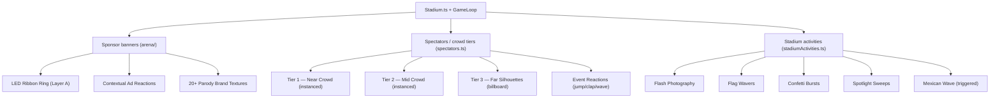

# 🏟️ Living Stadium Layer — Implementation Plan

Turn the empty upper bowl into a **living, monetizable stadium layer** with sponsor banners, animated crowd, and micro-activities.

---

## User Review Required

> [!IMPORTANT]
> **Logo Generation**: You mentioned using "nano banana" to generate sponsor logos. I'll generate **canvas-drawn** logos procedurally (neon text + glow + brand colors) for now — they'll look great on LED panels. If you'd prefer actual image-based logos, we can swap the texture source later. This approach keeps it self-contained with zero asset dependencies.

> [!IMPORTANT]
> **Performance Budget**: The current scene already runs 4000 instanced spectator sprites + post-processing bloom. The plan uses **instanced meshes**, **batched updates**, and **billboard sprites** to add ~2000 more crowd entities + banner system at negligible GPU cost. Target: maintain 60 FPS.

> [!NOTE]
> **Current WebGL orchestration**: `CricketSimulation.svelte` → **`EngineBridge`** → **`GameEngine`** + **`Renderer`** (`GameLoop` owns rAF). Stadium/crowd/sponsor layers compose through **`render/entities/Stadium.ts`** and **`engine/arena/*`**. Legacy **`ArenaScene.ts`**, **`CricketWebGLEngine.ts`**, and **`CrowdSystem.ts`** are **removed** — mount new stadium features onto **`Stadium.ts`** / arena modules rather than resurrecting duplicate orchestrators.

---

## Architecture Overview



---

## Proposed Changes

### Layer A — Sponsor Banner System

#### [NEW] [sponsorBanners.ts](file:///f:/Cricketsmash/apps/frontend/src/engine/arena/sponsorBanners.ts)

The **core monetization strip** — a continuous curved LED ribbon at the base of the stands (just above the existing boundary ad boards at `y≈3`, radius `≈40`).

**Brand Roster (20+ parody sponsors with taglines):**

| Brand | Tagline | Colors |
|-------|---------|--------|
| Boka Cola | "Taste the Crash" | Red + White |
| Burpsi | "The Next Gulp" | Blue + Red |
| Dead Bull | "Gives You Wings, Takes Them Back" | Yellow + Blue |
| Lazy's | "Bet You Can't Hit Just One" | Yellow + Red |
| Doridon'ts | "For the Bold (and Broke)" | Red + Orange |
| Niko | "Don't Do It" | White + Orange |
| Badidas | "Impossible is Guaranteed" | White + Black |
| Looma | "Forever Slower" | Black + Gold |
| No Balance | "Endorsed by Nobody" | Red + Blue |
| Weakbok | "I Am Not Fit" | Blue + Red |
| Failrari | "Built for Speed, Stuck in Park" | Red + Yellow |
| Lumbering-hini | "Slow and Expensive" | Yellow + Black |
| Poorsche | "There Is No Refund" | Black + Gold |
| BRW | "Barely Running Well" | Blue + White |
| Blastercard | "Priceless... and Empty" | Red + Orange |
| Visa-less | "Everywhere You Aren't" | Blue + Gold |
| Dapple | "Think Differently... About Your Wallet" | Silver + White |
| Samesung | "Do What You Can't Afford" | Blue + White |
| Heinecant | "Probably the Worst Beer" | Green + Red |
| Buddweaker | "King of Broken Dreams" | Red + Gold |
| Monster Lazy | "Unleash the Nap" | Green + Black |

**Architecture:**
- `SponsorBannerSystem` class with a `THREE.Group`
- Uses a segmented curved ribbon: **16 panels** arranged in an arc (inner bowl, radius ~42, y=3.5–5.5)
- Each panel is a `PlaneGeometry(6, 1.8)` with a `CanvasTexture`
- Textures are **procedurally drawn** (brand name + tagline + neon glow effects)
- Panels scroll: every **4 seconds**, all panels shift to the next brand with a **horizontal wipe** transition
- **Glow pulse** on active play (bowl/hit phases)

**Smart Contextual Ad Reactions:**
```
onGameEvent(event) → temporarily override visible banner text:
  '4 runs'  → "Lazy's — Crispy Shot! 🔥"
  '6 runs'  → "Dead Bull — He Flew! 🚀"
  'wicket'  → "Don't Do It — You Did It 😭"
  'miss'    → "No Balance — Obviously"
```
- Event flash lasts **2.5 seconds**, then returns to normal rotation
- Flash uses brighter glow + scale pulse animation

---

### Layer B — Enhanced Crowd System

#### [MODIFY] [spectators.ts](file:///f:/Cricketsmash/apps/frontend/src/engine/arena/spectators.ts)

**Complete rewrite** of the existing `SpectatorSystem` to create a **three-tier living crowd**:

**Tier 1 — Near Crowd (radius 40–55, y 3–12):**
- 1500 instanced planes (slightly larger: `0.2 × 0.35`)
- **5 color variations** per section (team colors, neutrals, hi-vis)
- **Height variation**: scale.y randomized 0.8–1.2
- **Random timing offsets** to break synchronization
- Animations: idle sway, clap cycle, random jump

**Tier 2 — Mid Crowd (radius 55–70, y 12–24):**  
- 2000 instanced planes (smaller: `0.15 × 0.25`, current size)
- More muted colors (blend toward stadium dark)
- Gentler wave motion
- Acts as **depth fill**

**Tier 3 — Far Silhouettes (radius 70–85, y 24–34):**
- 1500 instanced planes (tiny: `0.1 × 0.18`)
- Very dark, low-opacity silhouettes
- Occasional **flickering glow** (phone flashlights / lighters)
- Creates sense of **massive scale**

**Event-Based Crowd Reactions:**

| Event | Tier 1 | Tier 2 | Tier 3 |
|-------|--------|--------|--------|
| 6 runs | Jump + glow + wave | Stand + clap | Flash burst |
| 4 runs | Clap burst | Gentle sway | Slight flash |
| Wicket | Hands on head (shrink Y) | Slow settle | Dim |
| Idle | Slow sway | Very slow drift | Near static |
| Celebrate | Mexican wave cascade | Follow wave | Flash ripple |

#### Wire crowd reactions

Hook enhanced spectator tiers to **`EngineSnapshot` / phase** from `GameEngine` (via `Renderer` or `StadiumEntity.updateAnimations`) — **`CrowdSystem.ts` no longer exists**; consolidate event reactions in spectators + stadium facade code without a second orchestrator.

---

### Layer C — Stadium Activity System

#### [NEW] [stadiumActivities.ts](file:///f:/Cricketsmash/apps/frontend/src/engine/arena/stadiumActivities.ts)

Micro-activities that make the stands feel alive:

**Always-on Activities:**
- **Flash Photography**: 30 point lights that randomly flash white for 50ms, scattered in the upper tiers. Budget: ~10 active at any time, batched.
- **Flag Wavers**: 8 small animated planes with team-colored textures, gentle oscillation. Placed at key positions around the bowl.
- **Phone Flashlights**: 40 tiny point sprites in far tier that flicker on/off with random timing (concert vibe).

**Event-Triggered Effects:**
- **Mexican Wave**: On 6 runs — a radial wave that sweeps through all three tiers over 3 seconds. Implemented as a travelling sine wave applied to crowd Y-scale.
- **Confetti Burst**: On 6 runs — 200 small colored particles spawned above the pitch, falling with gravity + slight wind. Uses existing `ArenaParticleSystem` pattern.
- **Spotlight Sweep**: On match start — two cone-shaped spotlights sweep across the crowd over 4 seconds. Reuses SpotLight with animated target.

---

### Integration Layer

#### [MODIFY] [Stadium.ts](file:///f:/Cricketsmash/apps/frontend/src/render/entities/Stadium.ts)

- Import and mount / update sponsor ribbons, spectator systems, and `StadiumActivitySystem` (per existing module split under `engine/arena/`)
- Wire phase transitions → sponsor event reactions
- Wire phase transitions → crowd event triggers
- Wire phase transitions → activity triggers (confetti, wave, spotlight)
- Ensure updates run from **`Renderer`** / **`StadiumEntity`** each frame — **do not add a parallel scene root outside this path**

#### [MODIFY] [stadiumStructure.ts](file:///f:/Cricketsmash/apps/frontend/src/engine/arena/stadiumStructure.ts)

- Remove the existing `makeAdBoardTexture` boundary boards (replaced by sponsor system)
- Adjust tier geometry colors to better complement the new crowd colors

---

## File Summary

| File | Action | Purpose |
|------|--------|---------|
| `arena/sponsorBanners.ts` | NEW | LED ribbon sponsor system with 20+ brands, contextual reactions |
| `arena/spectators.ts` | REWRITE | Three-tier crowd with event reactions, color variety, height variation |
| `arena/stadiumActivities.ts` | NEW | Flash photography, flags, confetti, Mexican wave, spotlights |
| `spectators.ts` + `Stadium.ts` | MODIFY | Wire event-driven reactions from snapshot / phases |
| `render/entities/Stadium.ts` | MODIFY | Mount + update all living-stadium systems |
| `stadiumStructure.ts` | MODIFY | Remove old ad boards, adjust tier aesthetics |

---

## Open Questions

> [!IMPORTANT]
> **Old boundary ad boards**: The `stadiumStructure.ts` currently renders 28 boundary boards with generic text ("CRICKET CRASH", "BET LIVE", etc.). Should I:
> - **A)** Remove them entirely (the new sponsor ribbon replaces them)
> - **B)** Keep them but repopulate with parody brand names
> - **C)** Replace them with simpler "field-level" boards using the same parody brands
> 
> I recommend **C** — keep boundary boards but fill them with the parody brands for double exposure.

---

## Verification Plan

### Automated Tests
- `npm run typecheck` — ensure zero type errors across the monorepo
- `npm run build` — ensure successful production build

### Visual Verification
- Launch dev server and visually confirm:
  - Sponsor banners rotate every ~4s with smooth transitions
  - Contextual ad text appears on 4/6/wicket events
  - Three visible crowd tiers with color variation
  - Crowd reacts to game events (visible jump on sixes, settle on wickets)
  - Flash photography twinkles in upper tier
  - Confetti fires on big hits
  - Mexican wave propagates smoothly
  - 60 FPS maintained (Stats overlay)
