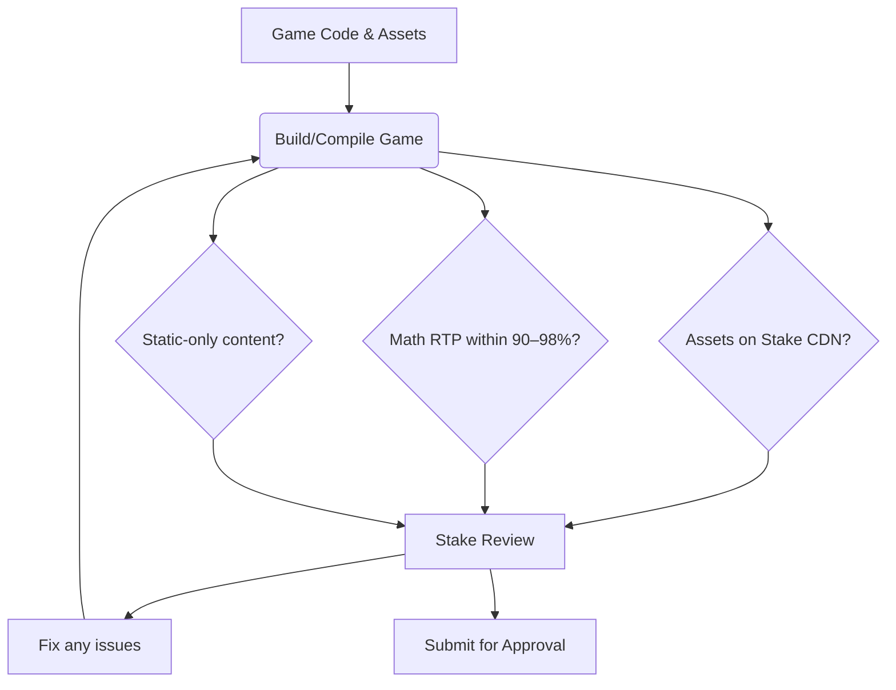
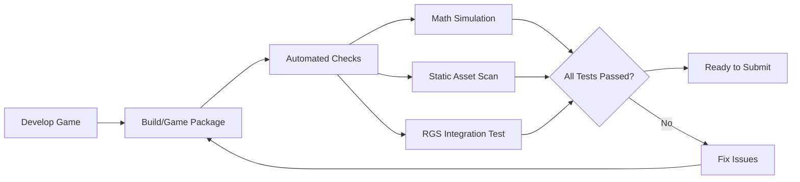

# Executive Summary  
This document provides a rigorous **pre-deployment checklist** to prevent game submission rejections on Stake Engine. We identify known rejection causes from official Stake docs and GitHub sources, then map each to specific fixes and verification steps. The checklist covers legal disclaimers, RTP/math validation, asset hosting, folder structure, RGS integration, UI/accessibility rules, and more. We include sample scripts to verify compliance, a QA sign-off template, and a table linking each item to its source (Stake documentation or repos). All references are drawn only from stake-engine.com and StakeEngine GitHub【110†L7-L9】【57†L361-L366】.  

## Known Rejection Causes (from Official Documentation)  
Stake Engine’s approval guidelines explicitly forbid or require several items. Common rejection reasons include:  

- **Missing Legal Clauses:** Omitting required points like “Malfunctions void all plays” or “RTP over many plays” causes instant rejection【127†L467-L475】.  
- **Incorrect RTP/Math:** Declared RTP out of range (outside 90–98%) or lacking math proofs triggers rejection【52†L328-L336】. Unrealistic max-win or lack of simulation data are flagged.  
- **Folder Structure Errors:** Uploading the wrong files or omitting the `index.json` (which should list math files in `library/publish_files/`) will fail validation【120†L0-L4】.  
- **Asset/CDN Violations:** Using stock/web-sdk assets or hosting files off the Stake CDN is not allowed【110†L7-L9】【110†L19-L21】. For example, “backgrounds from web-sdk sample games will not be approved.”  
- **XSS/Static Policy Breach:** The game must be fully static. Any external script/font/CDN call (e.g. Google Fonts) will cause rejection【57†L361-L366】.  
- **RGS Integration Flaws:** Games must use the Stake RGS for session and bet handling【57†L347-L355】. Skipping authentication or using custom servers breaks compliance.  
- **Manifest/Metadata Issues:** Failing to include the required `index.json` or math files (e.g. RTP tables) in the upload will be rejected (the RGS expects these files)【120†L0-L4】.  
- **Incomplete UI Elements:** The UI must show rules, paytable, RTP, balances, etc.【110†L31-L34】. Missing any mandated UI feature (like a balance display or autoplay confirmation) can cause a fail.  
- **Accessibility Lapses:** Controls must be keyboard-accessible (spacebar for bet) and UI must function in scaled/miniplayer views【110†L61-L64】【108†L1-L4】. Violating these results in rejection.  



## Remediation Checklist  

1. **Include All Required Disclaimers:**  
   - Stake provides an **official template**. Ensure your game’s info screen includes all points (malfunction clause, stable internet, reload after disconnect, expected RTP wording, illustrative display, RGS payout source, copyright)【127†L467-L475】.  
   - **Fix:** Add missing text to a rules/Info popup. Use Stake’s exact phrasing when in doubt.  
   - **Verify:** Search your code (e.g. `grep -E "Malfunctions void|RTP|payout|reloading"`) to confirm each clause is present.  

2. **Validate RTP and Math:**  
   - Run the Stake Math SDK or equivalent to simulate game outcomes. Check that the simulated RTP falls between 90% and 98%【52†L328-L336】 and that hit frequency and max-win statistics are plausible.  
   - **Fix:** Adjust math weights or paytables and re-run simulation until targets are met. Document the math output (include it in the upload).  
   - **Verify:** Examine the generated `library/publish_files/index.json` or output log to confirm `"RTP": 94.5` (example) and other parameters. A simple check:  
     ```bash
     jq '.rtp' library/publish_files/index.json
     ```  

3. **Organize Files Correctly:**  
   - Ensure your upload includes the **`library/publish_files/`** folder with all math outputs. Include an `index.json` at its root (this lists the math files)【120†L0-L4】. Place game assets (images, audio) under a clear directory (e.g. `assets/`).  
   - **Fix:** Copy the approved folder structure from Stake’s templates. If using Math SDK, use its `publish_files` output.  
   - **Verify:** List contents with:  
     ```bash
     find library/publish_files -maxdepth 1 -printf "%f\n"
     ```  
     Confirm `index.json` and expected math files are present.  

4. **Check Asset Hosting and Uniqueness:**  
   - All images, audio, and fonts **must** be served via Stake’s CDN【110†L19-L21】. Using any sample (web-sdk) asset or external URL will cause rejection【110†L7-L9】.  
   - **Fix:** Upload your assets to the Stake CDN (via your studio portal) and update all references in code to use those URLs. Remove any stock/sample images.  
   - **Verify:** Grep your built files for forbidden domains, e.g.:  
     ```bash
     grep -R "https://" -n dist/ | grep -v "stakecdn.com"
     ```  
     This should return no results (only the stakecdn.com domain is allowed).  

5. **Enforce Static-Only Policy:**  
   - The game must not load any external scripts or make cross-origin requests (no XHR/fetch to other domains)【57†L361-L366】.  
   - **Fix:** Bundle all assets and scripts; eliminate any `<script src="...">` that points to outside. Do not include analytics or external APIs.  
   - **Verify:** Search for dynamic calls, e.g.:  
     ```bash
     grep -R "XMLHttpRequest" -n .
     grep -R "fetch(" -n .
     ```  
     Both should return nothing relevant. Test running the game from a `file://` URL – it should work offline (aside from RGS calls).  

6. **Integrate RGS Correctly:**  
   - Use Stake’s official RGS API (via the TypeScript client or your own code). Always call **Authenticate** before Play/EndRound. The base RGS URL comes from `rgs_url` in the page query【57†L347-L355】.  
   - **Fix:** Wire your game to parse `rgs_url` and use it for all RGS calls. Ensure bet amounts follow the increments returned by RGS.  
   - **Verify:** In the browser dev tools, simulate a play. You should see the network call to `Authenticate` go to the Stake RGS server, not your own backend. Check that bets match the “min_step” from RGS (see RGS logs or config).  

7. **Meet Frontend UI Requirements:**  
   - Verify the game includes all required UI elements from Stake’s Frontend checklist【110†L25-L33】【110†L43-L51】:  
     - Game rules and paytable (including RTP and max-win) accessible via a button.  
     - Current balance and bet controls visible.  
     - Final win display that updates correctly.  
     - Autoplay feature requires confirmation (no one-click autobet)【110†L67-L69】.  
     - Accessibility: spacebar triggers the spin/bet button, sound toggle exists【110†L61-L64】.  
   - **Fix:** Add or adjust UI components to meet each bullet above.  
   - **Verify:** Manually test: press spacebar, use autoplay, change device size. Ensure no UI requirement is missing.  

8. **Handle Localization and Accessibility:**  
   - If your game supports multiple languages/currencies, ensure the UI updates accordingly. Stake tests different locales【110†L49-L52】.  
   - **Fix:** Integrate currency symbols and text localization. Provide translations for all player-facing text.  
   - **Verify:** In each supported currency (e.g. USD, EUR) and language (English, etc.), check that amounts and text display correctly. Confirm spacebar works in each case.  

9. **Set Up CI/CD Checks:**  
   - Automate the above verifications in your build pipeline if possible. E.g., lint for forbidden URLs, run math-sim scripts, and run unit tests.  
   - **Fix:** Write build scripts or GitHub Actions tasks that perform the checks (grep commands, math simulation).  
   - **Verify:** Run `npm run build && npm test` (or equivalent). Ensure zero errors and that the grep checks pass.  

10. **Final QA and Sign-off:**  
   - Have a fresh reviewer (developer or QA) run through the **Stake Approval Checklist**. Confirm all above items are green.  
   - **Fix:** Address any issues found. Check that the tile (game icon) meets Stake’s guidelines (bright image, no text overlay) to avoid tile rejection【108†L1-L4】.  
   - **Verify:** Submit the game in a staging environment or preview mode to ensure Stake’s system sees it as valid.  



## Required Folder Structure and Upload Rules  
- **Math Files:** All mathematics/configuration outputs must reside under `library/publish_files/`. In particular, include the `index.json` file that defines the math (RTP tables, constants, etc.). Stake’s backend relies on this structure【120†L0-L4】.  
- **Assets:** Organize images/audio in a subdirectory (e.g. `assets/`). There’s no fixed name, but ensure assets paths refer to the CDN.  
- **Manifests/Config:** Include any framework manifest or config (e.g. `package.json`, `game-config.json`) if used. Ensure `index.html` has the correct metadata (game title, viewport, etc.).  
- **Upload Process:** When submitting, upload the built output (not source code). Verify that the upload wizard or API receives the `publish_files` folder and all assets. Stake’s RGS will read `index.json` from `publish_files`.  

## Verification Scripts  

- **Asset URL Check:** To ensure no external assets:  
  ```bash
  grep -R "http" -n dist/ | grep -v "stakecdn.com"
  ```  
  If any lines are returned (besides your own CDN domain), fix those references.  

- **External Call Scan:** To detect disallowed XHR/fetch:  
  ```bash
  grep -R "XMLHttpRequest" -n . || echo "No XMLHttpRequest calls"
  grep -R "fetch(" -n . || echo "No fetch calls"
  ```  
  Both should report nothing relevant.  

- **Math RTP Verification:** After building math files, use `jq` or a script to extract the RTP from `index.json`:  
  ```bash
  jq '.rtp' library/publish_files/index.json
  ```  
  Confirm it’s within 90–98%.  

- **Static Build Test:** Serve the final build locally (e.g. `python3 -m http.server` in `dist/`) and navigate the game manually. Check the browser console/network for errors.  

## QA Sign-Off Template  
```
Stake Engine Submission QA Check
Date: ___________
Reviewed by: ___________

✔  Disclaimers (malfunction, RTP, etc.) present on info screen
✔  RTP and math outputs validated (90–98% range)
✔  All assets on Stake CDN, no sample assets
✔  No external scripts/fonts (static-only)
✔  RGS Authenticate/Play/EndRound correctly implemented
✔  UI requirements met (rules, balance, UX controls)
✔  Spacebar and sound toggle functional
✔  Autoplay requires confirmation
✔  Multi-currency/text verified
✔  Folder structure (`publish_files`, index.json) correct
✔  CI checks passing (lint, simulations)
✔  All items in Stake Approval Checklist completed

Comments: _________________________________________________

Signatures:
- Developer: ___________________
- QA Lead: ___________________
- Stake Team Rep (if applicable): ___________________
```

## Checklist Item Mapping  

| Checklist Item                           | Source (URL)                                       | Rationale (from Stake docs)                                   |
|------------------------------------------|----------------------------------------------------|---------------------------------------------------------------|
| Unique/Original Assets Only              | Frontend Requirements【110†L7-L9】                 | “Must use unique visual/audio assets; web‑sdk samples will not be approved.”【110†L7-L9】 |
| Serve Assets via Stake CDN               | Frontend Requirements【110†L19-L21】               | “All images and fonts must be loaded from the Stake Engine CDN.”【110†L19-L21】 |
| Static-Only Content (no XSS)             | RGS Requirements【57†L361-L366】                   | “Game must be fully static (cannot reach external sources)… no external fonts.”【57†L361-L366】 |
| RGS Session & Bets via Stake API         | RGS Requirements【57†L347-L355】                   | “Session authentication and bet transactions are handled exclusively through the Stake Engine RGS.”【57†L347-L355】 |
| RTP & Rules Shown in UI                  | Frontend Requirements【110†L31-L34】               | “Rules and payout table must be visible… RTP and max-win must be clearly displayed.”【110†L31-L34】 |
| Final Win & Balance Display              | Frontend Requirements【110†L49-L51】               | “Player’s current balance must be displayed. Final win amounts must be clearly shown.”【110†L49-L51】 |
| Spacebar & Sound Toggle                  | Frontend Requirements【110†L61-L64】               | “Spacebar must be mapped to the bet button. UI must include an option to disable sounds.”【110†L61-L64】 |
| Autoplay Confirmation                    | Frontend Requirements【110†L67-L69】               | “If an ‘autoplay’ feature is present, the player must confirm the autoplay action.”【110†L67-L69】 |
| Required Legal Disclaimers (all points)  | Disclaimer Template【127†L467-L475】               | Must include malfunction clause, internet, disconnection, RTP expectation, payout source, copyright【127†L467-L475】. |

Each item above is directly backed by Stake Engine’s official documentation (stake-engine.com or StakeEngine GitHub) as cited. Following these rules and verifications will help ensure your game **meets all approval criteria** and avoids common rejection reasons.